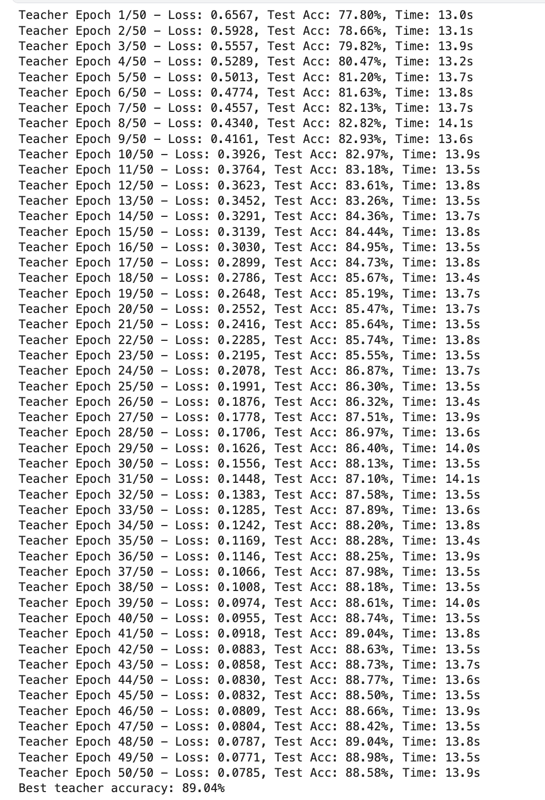
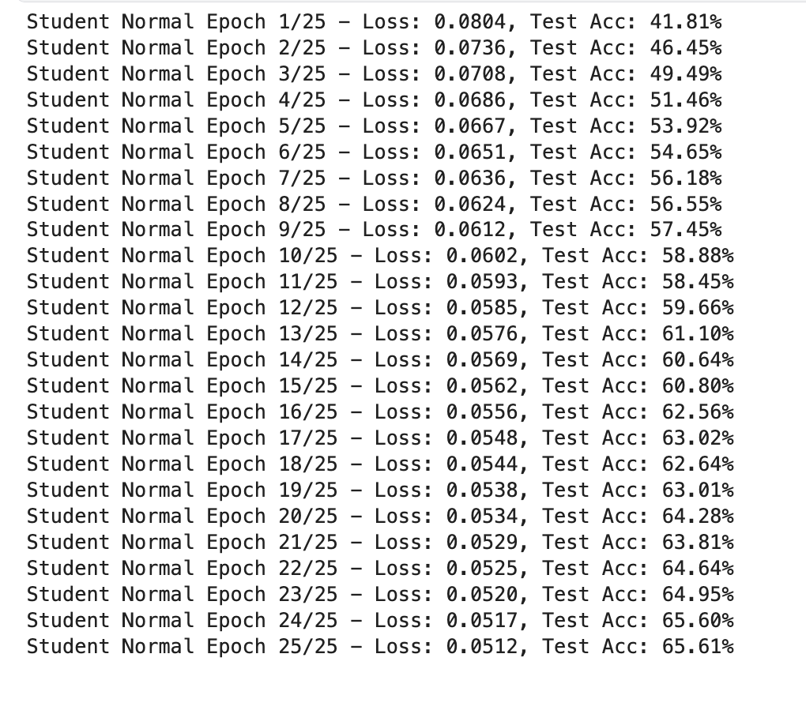
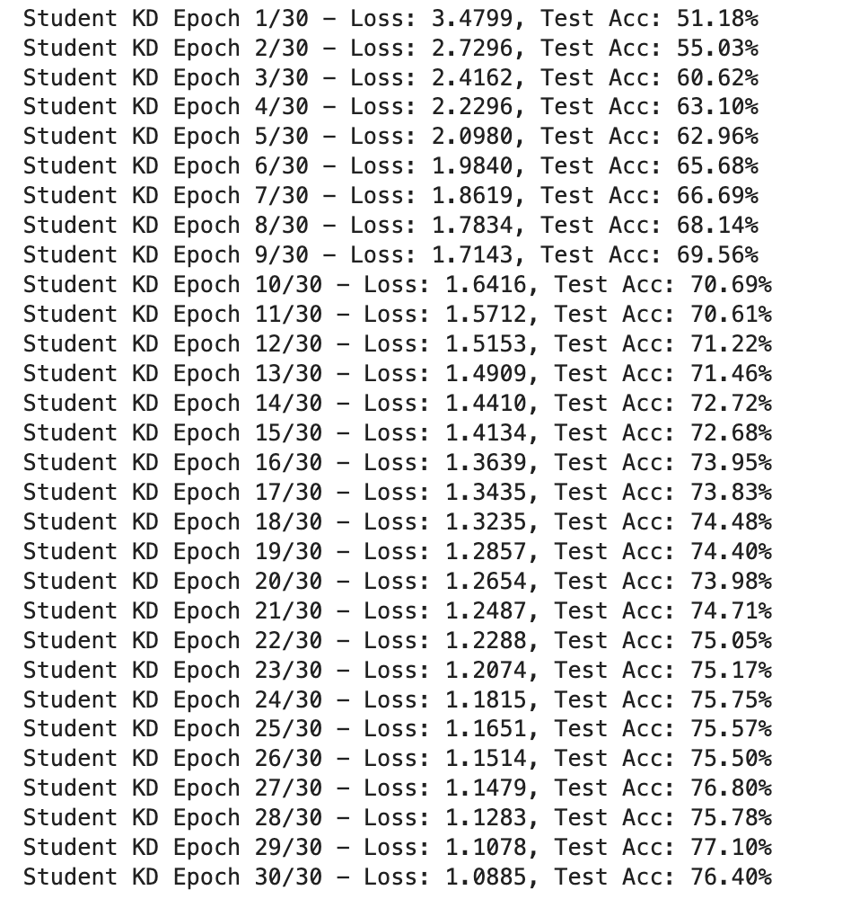
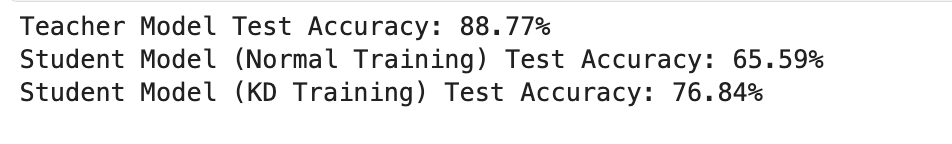

# Knowledge Distillation using KL Divergence Loss in PyTorch

This repository contains a Jupyter Notebook that demonstrates Knowledge Distillation (KD) on the CIFAR‑10 dataset using PyTorch. We first train a high‑capacity teacher CNN using standard cross‑entropy loss. Then, we define a simpler student model and train it using two methods:
  
1. **Normal Training:** The student is trained using standard loss (MSE loss in our example).
2. **Knowledge Distillation (KD):** The student is trained using a combination of cross‑entropy loss and KL divergence loss between the teacher’s and student’s softened outputs.

At the end, we compare the test performances of the teacher, the normally trained student, and the KD-trained student.

## Teacher Model Training

The teacher model is a CNN with three convolutional blocks followed by a fully connected classifier. It is trained with SGD (momentum and weight decay) and a cosine annealing scheduler.

*Training log example for the Teacher Model:*

---

## Student Model Training

### Normal Training

The student model, a simpler CNN, is first trained using standard MSE loss against one-hot encoded labels.

*Training log example for Normal Student Training:*

### Training with Knowledge Distillation

Next, the student model is retrained using knowledge distillation. In each training step:
- The teacher model produces softened predictions (using a temperature parameter).
- The student model computes predictions.
- Two losses are computed:
  - **CE Loss:** Standard cross‑entropy between the student’s predictions and true labels.
  - **KD Loss:** KL divergence between the teacher’s and student’s softened outputs.
- The final loss is the weighted sum:

$$
\text{total\_loss} = \alpha \cdot \text{CE\_loss} + (1-\alpha) \cdot (\text{temperature}^2) \cdot \text{KD\_loss}
$$

*Training log example for KD Student Training:*

---

## Results and Comparison

After training, the models are evaluated on the test set. The results compare:
- **Teacher Model Accuracy**
- **Student Model (Normal Training) Accuracy**
- **Student Model (KD Training) Accuracy**

*Final Accuracy Comparison:*

The comparison shows that knowledge distillation can help the student model achieve improved performance, narrowing the gap between the student and the teacher.

---
